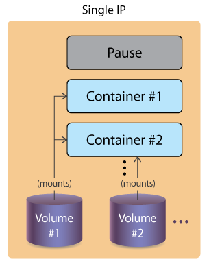

# Master Node Components
## kube-apiserver
The kube-apiserver is central to the operation of the Kubernetes cluster. 

All calls, both internal and external traffic, are handled via this agent. All actions are accepted and validated by this agent, and it is the only agent which connects to the etcd database. As a result, it acts as a master process for the entire cluster, and acts as a frontend of the cluster's shared state. Each API call goes through three steps: authentication, authorization, and several admission controllers

## kube-scheduler
The kube-scheduler uses an algorithm to determine which node will host a Pod of containers. The scheduler will try to view available resources (such as volumes) to bind, and then try and retry to deploy the Pod based on availability and success.

There are several ways you can affect the algorithm, or a custom scheduler could be used instead. You can also bind a Pod to a particular node, though the Pod may remain in a pending state due to other settings.

One of the first settings referenced is if the Pod can be deployed within the current quota restrictions. If so, then the taints and tolerations, and labels of the Pods are used along with those of the nodes to determine the proper placement.

You can find more [details about the scheduler on GitHub.](https://github.com/kubernetes/kubernetes/blob/master/pkg/scheduler/scheduler.go)

## etcd Database
The state of the cluster, networking, and other persistent information is kept in an etcd database, or, more accurately, a b+tree key-value store. Rather than finding and changing an entry, values are always appended to the end. Previous copies of the data are then marked for future removal by a compaction process. It works with curl and other HTTP libraries, and provides reliable watch queries.

Simultaneous requests to update a value all travel via the kube-apiserver, which then passes along the request to etcd in a series. The first request would update the database. The second request would no longer have the same version number, in which case the kube-apiserver would reply with an error 409 to the requester. There is no logic past that response on the server side, meaning the client needs to expect this and act upon the denial to update. 

There is a master database along with possible followers. They communicate with each other on an ongoing basis to determine which will be master, and determine another in the event of failure. While very fast and potentially durable, there have been some hiccups with some features like whole cluster upgrades. Starting with v1.15.1, kubeadm allows easy deployment of a multi-master cluster with stacked etcd or an external database cluster.

## Other Agents
The kube-controller-manager is a core control loop daemon which interacts with the kube-apiserver to determine the state of the cluster. If the state does not match, the manager will contact the necessary controller to match the desired state. There are several controllers in use, such as endpoints, namespace, and replication. The full list has expanded as Kubernetes has matured.

Remaining in beta as of v1.16, the cloud-controller-manager interacts with agents outside of the cloud. It handles tasks once handled by kube-controller-manager. This allows faster changes without altering the core Kubernetes control process. Each kubelet must use the --cloud-provider-external settings passed to the binary.

# Worker Nodes
All worker nodes run the kubelet and kube-proxy, as well as the container engine, such as Docker or cri-o. Other management daemons are deployed to watch these agents or provide services not yet included with Kubernetes.
You can also run an alternative to the Docker engine: rkt by CoreOS. To learn how you can do that, you should check the Documentation. In future releases, it is highly likely that Kubern​​​​​​​etes will support additional container runtime engines.
Supervisord is a lightweight process monitor used in traditional Linux environments to monitor and notify about other processes. In the cluster, this daemon monitors both the kubelet and docker processes. It will try to restart them if they fail, and log events.
Kubernetes does not have cluster-wide logging yet. Instead, another CNCF project is used, called [Fluentd](https://www.fluentd.org/). When implemented, it provides a unified logging layer for the cluster, which filters, buffers, and routes messages.

## kubelet
The kubelet interacts with the underlying Docker Engine also installed on all the nodes, and makes sure that the containers that need to run are actually running.

It is the heavy lifter for changes and configuration on worker nodes. It accepts the API calls for Pod specifications (a PodSpec is a JSON or YAML file that describes a Pod). It will work to configure the local node until the specification has been met.

Should a Pod require access to storage, Secrets or ConfigMaps, the kubelet will ensure access or creation. It also sends back status to the kube-apiserver for eventual persistence.

## kube-proxy
The kube-proxy is in charge of managing the network connectivity to the containers. It does so through the use of iptables entries. It also has the userspace mode, in which it monitors Services and Endpoints using a random high-number port to proxy traffic. Use of ipvs can be enabled, with the expectation it will become the default, replacing iptables.

## Container Runtime
The container runtime is the software that is responsible for running containers. Kubernetes supports several container runtimes: Docker, containerd, cri-o, rktlet and any implementation of the [Kubernetes CRI (Container Runtime Interface)](https://github.com/kubernetes/community/blob/master/contributors/devel/sig-node/container-runtime-interface.md).

# Pods
The whole point of Kubernetes is to orchestrate the life cycle of a container. We do not interact with particular containers. Instead, the smallest unit we can work with is a [Pod](https://kubernetes.io/docs/concepts/workloads/pods/pod/). Some would say a pod of whales or peas-in-a-pod. Due to shared resources, the design of a Pod typically follows a one-process-per-container architecture.

Containers in a Pod are started in parallel by default. As a result, there is no way to determine which container becomes available first inside a Pod. initContainers can be used to ensure some containers are ready before others in a pod. To support a single process running in a container, you may need logging, a proxy, or special adapter. These tasks are often handled by other containers in the same Pod.

There is only one IP address per Pod with most network plugins. HPE Labs created a plugin which allows more than one IP per pod. As a result, if there is more than one container, they must share the IP. To communicate with each other, they can use IPC, the loopback interface, or a shared filesystem.

While Pods are often deployed with one application container in each, a common reason to have multiple containers in a Pod is for logging. You may find the term sidecar for a container dedicated to performing a helper task, like handling logs and responding to requests, as the primary application container may have this ability.

Pods and other objects can be created in several ways. They can be created by using a generator, which. historically, has changed with each release:

`$ kubectl run newpod --image=nginx --generator=run-pod/v1`

Or, they can be created and deleted using properly formatted JSON or YAML files:
```
$ kubectl create -f newpod.yaml
$ kubectl delete -f newpod.yaml
```
Other objects will be created by operators/watch-loops to ensure the specifications and current status are the same.

# Controllers/Operators
An important concept for orchestration is the use of controllers. These are also known as watch-loops and operators. They query the current state, compare it against the spec, and execute code based on how they differ. Various controllers ship with Kubernetes, and you can create your own, as well. A simplified view of a controller is an agent, or Informer, and a downstream store. Using a **DeltaFIFO** queue, the source and downstream are compared. A loop process receives an **obj** or object, which is an array of deltas from the FIFO queue. As long as the delta is not of the type **Deleted**, the logic of the controller is used to create or modify some object until it matches the specification.

The Informer which uses the API server as a source requests the state of an object via an API call. The data is cached to minimize API server transactions. A similar agent is the SharedInformer; objects are often used by multiple other objects. It creates a shared cache of the state for multiple requests.

A Workqueue uses a key to hand out tasks to various workers. The standard Go workqueues of rate limiting, delayed, and time queue are typically used.

The **endpoints, namespace**, and **serviceaccounts** controllers each manage the eponymous resources for Pods.

# Single IP per Pod

A Pod represents a group of co-located containers with some associated data volumes. All containers in a Pod share the same network namespace.

The diagram below shows a Pod with two containers, A and B, and two data volumes, 1 and 2. Containers A and B share the network namespace of the third container, known as the pause container. The pause container is used to get an IP address, then all the containers in the Pod will use its network namespace. Volumes 1 and 2 are shown for completeness.

<p align="center">
  
</p>

To communicate with each other, containers can use the loopback interface, write to files on a common filesystem, or via inter-process communication (IPC). As a result, co-locating applications in the same pod may have issues. There is a network plugin which will allow more than one IP address, but so far, it has only been used within HPE labs.

# CNI Network Configuration File
CNI Network Configuration File
To provide container networking, Kubernetes is standardizing on the [Container Network Interface (CNI)](https://github.com/containernetworking/cni) specification. As of v1.6.0, kubeadm (the Kubernetes cluster bootstrapping tool) uses CNI as the default network interface mechanism.

CNI is an emerging specification with associated libraries to write plugins that configure container networking and remove allocated resources when the container is deleted. Its aim is to provide a common interface between the various networking solutions and container runtimes. As the CNI specification is language-agnostic, there are many plugins from Amazon ECS, to SR-IOV, to Cloud Foundry, and more.

With CNI, you can write a network configuration file:
```
{
   "cniVersion": "0.2.0",
   "name": "mynet",
   "type": "bridge",
   "bridge": "cni0",
   "isGateway": true,
   "ipMasq": true,
   "ipam": {
       "type": "host-local",
       "subnet": "10.22.0.0/16",
       "routes": [
           { "dst": "0.0.0.0/0" }
            ]
   }
}
```
This configuration defines a standard Linux bridge named **cni0**, which will give out IP addresses in the subnet **10.22.0.0./16**. The bridge plugin will configure the network interfaces in the correct namespaces to define the container network properly. The main **README** of the [CNI GitHub repository](https://github.com/containernetworking/cni) has more information.

# Pod-to-Pod Communication
While a CNI plugin can be used to configure the network of a pod and provide a single IP per pod, CNI does not help you with pod-to-pod communication across nodes.

The early requirement from Kubernetes was the following:

All pods can communicate with each other across nodes.
All nodes can communicate with all pods.
No Network Address Translation (NAT).
Basically, all IPs involved (nodes and pods) are routable without NAT. This can be achieved at the physical network infrastructure if you have access to it (e.g. GKE). Or, this can be achieved with a software defined overlay with solutions like:

* Weave
* Flannel
* Calico
* Romana.

Most network plugins now support the use of Network Policies, which act as an internal firewall, limiting ingress and egress traffic.

For more information see the ["Cluster Networking"](https://kubernetes.io/docs/concepts/cluster-administration/networking/) Documentation page or the list of [networking add-ons](https://kubernetes.io/docs/concepts/cluster-administration/addons/).